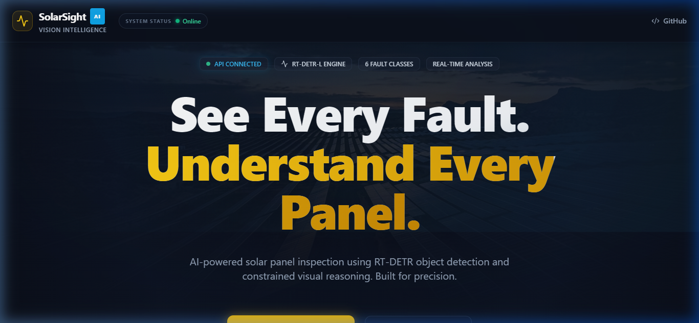
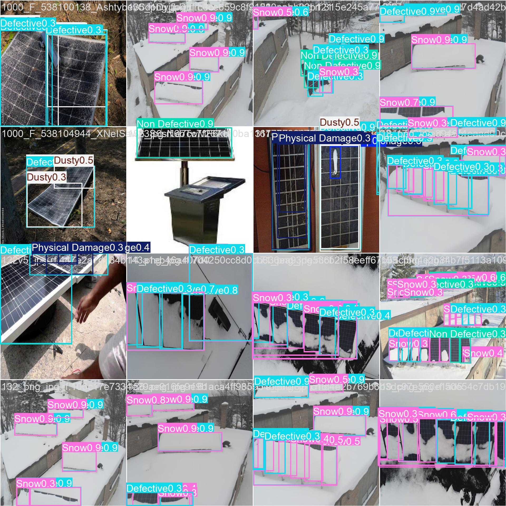
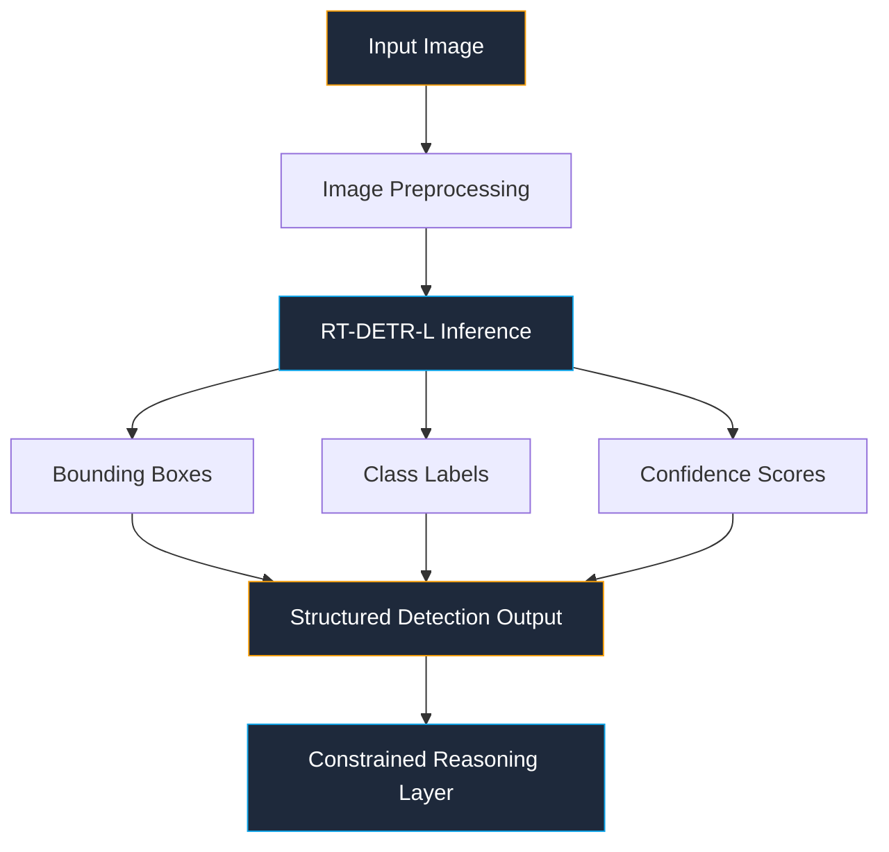
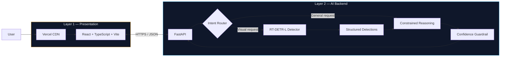
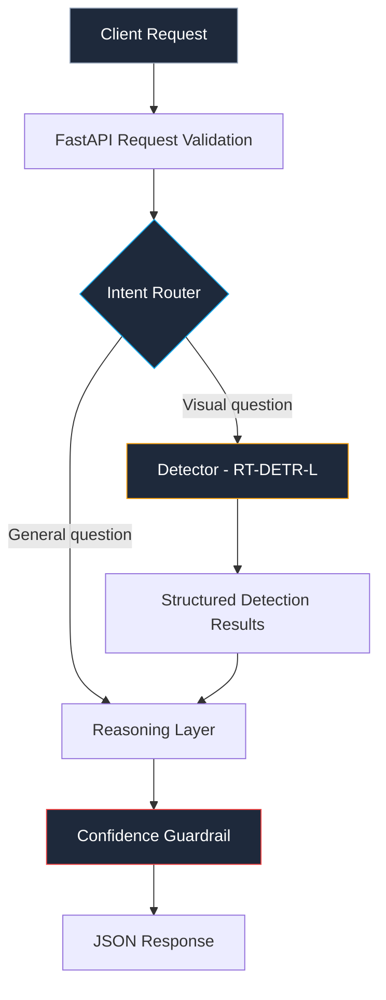
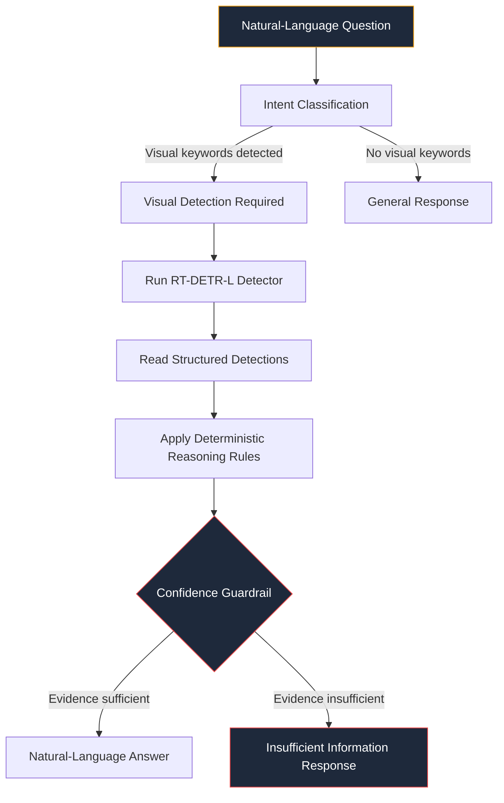
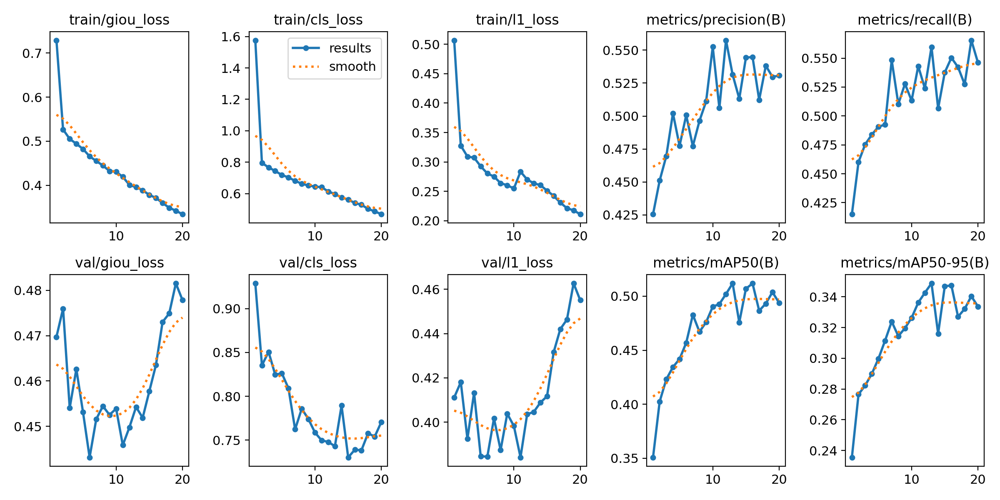
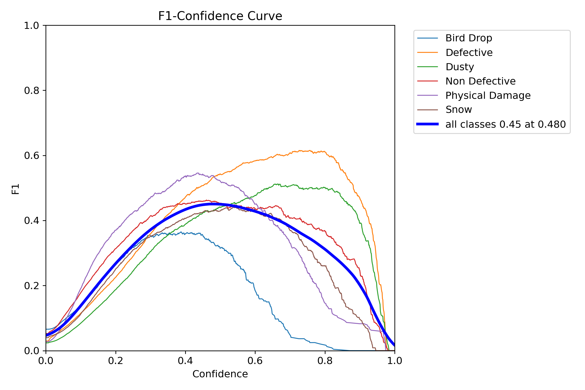
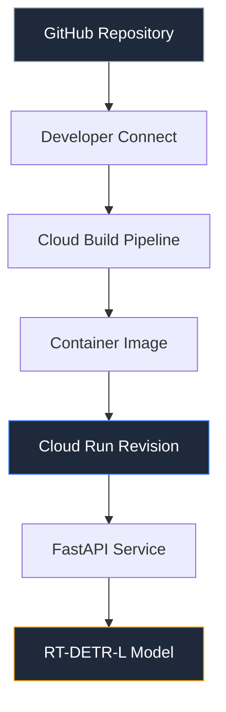
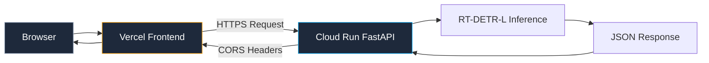

<div align="center">

# ☀️ SolarSight

### AI-Powered Solar Panel Fault Detection & Constrained Visual Reasoning

SolarSight uses a fine-tuned **RT-DETR-L** object detector to identify solar-panel conditions and a lightweight **constrained reasoning layer** to answer natural-language questions using structured visual evidence.

[](https://solar-sight-mu.vercel.app)
[](https://solarsight-api-243267443769.asia-south1.run.app/docs)

---

[](https://www.python.org/)
[](https://fastapi.tiangolo.com/)
[](https://reactjs.org/)
[](https://www.typescriptlang.org/)
[](https://vitejs.dev/)
[](https://pytorch.org/)
[](https://ultralytics.com/)
[](https://cloud.google.com/run)
[](https://vercel.com/)
[](https://docs.pytest.org/)

</div>

---

## 📑 Table of Contents

- [Product Preview](#-product-preview)
- [Problem](#-problem)
- [Solution](#-solution)
- [Detection Example](#-detection-example)
- [Computer Vision Pipeline](#-computer-vision-pipeline)
- [Production Architecture](#️-production-architecture)
- [Backend Architecture](#️-backend-architecture--layer-2)
- [Constrained Reasoning](#-constrained-reasoning)
- [API Layer](#-api-layer)
- [Dataset](#-dataset)
- [Dataset Preprocessing](#-dataset-preprocessing)
- [Model & Training](#-model--training)
- [Model Evaluation](#-model-evaluation)
- [Evaluation Results](#-evaluation-results)
- [Class-wise Performance](#-class-wise-test-performance)
- [Failure Cases & Limitations](#️-failure-cases--limitations)
- [Google Cloud Run Deployment](#️-google-cloud-run-deployment)
- [Frontend ↔ Backend Connection](#-frontend--backend-production-connection)
- [Testing & Validation](#-testing--validation)
- [End-to-End Validation](#-end-to-end-validation)
- [Engineering Challenges](#️-engineering-challenges)
- [Reproducibility](#-reproducibility)
- [Project Structure](#-project-structure)
- [Docker](#-docker)
- [Local Development](#-local-development)
- [Future Improvements](#-future-improvements)

---

## 🖥️ Product Preview

<div align="center">
  
  <br/>
  <em>SolarSight web interface — real-time visual inspection with detection overlay and constrained reasoning console.</em>
</div>

---

## 🎯 Problem

Solar panel inspection can involve large numbers of panels, and visually identifying faults is difficult and time-consuming. Defects such as physical damage, bird droppings, dust accumulation, and snow coverage share overlapping visual signatures that make manual inspection error-prone.

SolarSight addresses this by using computer vision to identify six panel conditions:

| Class | Description |
|---|---|
| **Bird Drop** | Organic residue from bird activity |
| **Defective** | Manufacturing or degradation defects |
| **Dusty** | Surface dust accumulation |
| **Non Defective** | Healthy panel regions |
| **Physical Damage** | Cracks, chips, or structural damage |
| **Snow** | Snow or ice coverage |

The system then provides evidence-based natural-language reasoning over the detector output.

---

## 💡 Solution

SolarSight provides an end-to-end web application that:

1. Accepts uploaded solar panel images through a modern React interface.
2. Performs object detection using a fine-tuned RT-DETR-L model.
3. Returns structured bounding boxes with class labels and confidence scores.
4. Applies a deterministic constrained reasoning layer to answer natural-language questions using only the visual evidence available.
5. Triggers a **confidence guardrail** when visual evidence is insufficient — it does not guess.

---

## 🔎 Detection Example

<div align="center">
  
  <br/>
  <em>Example inference from the trained RT-DETR-L model on validation data. Bounding boxes and confidence scores are generated directly by the detector. This example does not represent overall model performance.</em>
</div>

---

## 🧠 Computer Vision Pipeline



**Pipeline stages:**

| Stage | Description |
|---|---|
| **Image Preprocessing** | Input image is decoded and converted to RGB via PIL |
| **RT-DETR-L Inference** | The fine-tuned model processes the image at 640×640 resolution |
| **Bounding Boxes** | Axis-aligned bounding boxes in `(x1, y1, x2, y2)` format |
| **Class Labels** | One of six fault categories assigned per detection |
| **Confidence Scores** | Per-detection confidence value from the model |
| **Structured Output** | JSON payload with detections array, counts, and metadata |
| **Reasoning Layer** | Deterministic logic that interprets structured evidence |

---

## 🏗️ Production Architecture

The deployed system consists of two independent application layers:



### Layer 1 — Frontend / Presentation Layer

| Aspect | Detail |
|---|---|
| **Technology** | React, TypeScript, Vite, Tailwind CSS |
| **Deployment** | Vercel |
| **Responsibilities** | Image upload, detection visualization with bounding box overlays, confidence display, reasoning interface, API communication, live system health display |

### Layer 2 — Backend / AI Inference Layer

| Aspect | Detail |
|---|---|
| **Technology** | Python, FastAPI, Ultralytics, PyTorch, RT-DETR-L |
| **Deployment** | Google Cloud Run |
| **Responsibilities** | Request validation, model loading, inference, structured detection output, intent routing, constrained reasoning, confidence guardrail |

---

## ⚙️ Backend Architecture — Layer 2



**Module responsibilities:**

| Module | File | Role |
|---|---|---|
| **API Layer** | `app/main.py` | FastAPI application with `/health`, `/detect`, and `/reason` endpoints. Handles CORS, request validation, file parsing, and error responses. |
| **Detector** | `app/detector.py` | Loads the trained RT-DETR-L model (`model/best.pt`), runs inference on uploaded images, and returns structured bounding boxes with class names and confidence scores. Uses singleton pattern for model reuse. |
| **Reasoning** | `app/reasoning.py` | Implements keyword-based intent routing and deterministic reasoning over structured detections. Applies confidence guardrail when evidence is insufficient. |

---

## 💬 Constrained Reasoning

The reasoning layer is **lightweight Python logic** — not an LLM, not an agent framework.



**Key design principles:**

- The reasoning layer operates on **structured detector evidence** only.
- It does not blindly invent visual information.
- It can bypass the detector for general non-visual questions.
- If evidence is insufficient — either no detections exist or the detected classes don't match the question — it returns an **"Insufficient information from the detector to answer reliably"** response rather than guessing.
- Questions are mapped to expected fault classes via keyword matching.

> **Note:** This implementation does **not** use LangChain, LangGraph, CrewAI, AutoGen, or any other LLM/agent orchestration framework.

---

## 🔌 API Layer

Three endpoints are exposed:

### `GET /health`

Returns the current API and model status.

```json
{
  "status": "ok",
  "model": "RT-DETR-L"
}
```

### `POST /detect`

Accepts a multipart image upload and returns structured detections.

**Request:** `multipart/form-data`
- `file` (required) — image file (JPEG, PNG, etc.)
- `conf` (optional, default: `0.50`) — confidence threshold

**Response:**
```json
{
  "success": true,
  "detections": [
    {
      "class_id": 4,
      "class_name": "Physical Damage",
      "confidence": 0.72,
      "bounding_box": {
        "x1": 120.5,
        "y1": 45.2,
        "x2": 380.1,
        "y2": 290.7
      }
    }
  ],
  "counts": {
    "Physical Damage": 1
  },
  "total_detections": 1
}
```

### `POST /reason`

Accepts a question and optional image for constrained visual reasoning.

**Request:** `multipart/form-data`
- `question` (required) — natural-language question
- `file` (optional) — image file, required for visual questions
- `conf` (optional, default: `0.50`) — confidence threshold

**Response:**
```json
{
  "question": "Is there damage?",
  "intent": "visual_detection_required",
  "answer": "Physical Damage was detected with 0.72 confidence.",
  "relevant_detections": [...],
  "guardrail_triggered": false
}
```

**Interactive API documentation:**
[Swagger UI](https://solarsight-api-243267443769.asia-south1.run.app/docs) •
[Health Check](https://solarsight-api-243267443769.asia-south1.run.app/health)

---

## 🗂 Dataset

| Property | Value |
|---|---|
| **Source** | [Roboflow Universe](https://universe.roboflow.com/6rianstorm/solar-panel-fault-dataset-new) |
| **Dataset** | Solar Panel Fault Dataset New |
| **Creator** | 6rianstorm |
| **Version** | v2 |
| **Total Images** | 8,730 |
| **Resolution** | 640×640 |

**Data splits and object counts:**

| Split | Images | Objects |
|---|---:|---:|
| Train | 7,669 | 41,014 |
| Validation | 611 | 3,453 |
| Test | 450 | 2,796 |

**Six target classes:** Bird Drop · Defective · Dusty · Non Defective · Physical Damage · Snow

> **Important:** The original dataset and annotations were sourced from Roboflow Universe and were not created by the project author.

---

## 🛠 Dataset Preprocessing

The source dataset contained **mixed YOLO detection and segmentation annotations** — both bounding box labels and polygon segmentation masks existed across the dataset.

To produce a consistent detection-ready dataset:

1. **Polygon annotations** were programmatically converted into **axis-aligned bounding boxes** by computing the minimum enclosing rectangle for each polygon.
2. The resulting dataset uses a uniform YOLO detection format across all splits.
3. The 8,730 images were divided into train/validation/test splits with approximately 88%/7%/5% distribution.

This preprocessing ensured that the RT-DETR-L model received consistent bounding-box supervision regardless of the original annotation format.

---

## 🤖 Model & Training

| Parameter | Value |
|---|---|
| **Model** | RT-DETR-L |
| **Pretrained checkpoint** | `rtdetr-l.pt` |
| **Transferred weights** | 926 / 941 |
| **Framework** | Ultralytics + PyTorch |
| **Epochs** | 20 |
| **Batch size** | 8 |
| **Image size** | 640 |
| **Optimizer** | AdamW |
| **Learning rate** | 0.001 |
| **Momentum** | 0.9 |
| **Seed** | 42 |
| **AMP** | Enabled |
| **Workers** | 2 |
| **GPU** | Tesla T4 |
| **Training time** | ~3.066 hours |

<details>
<summary><strong>Training Curves</strong></summary>

<div align="center">
  
  <br/>
  <em>Training and validation loss/metric curves over 20 epochs.</em>
</div>

</details>

---

## 📊 Model Evaluation

<div align="center">
  
  <br/>
  <em>Normalized confusion matrix on the test set (450 images, 2,796 objects). The matrix reveals inter-class confusion patterns, particularly between visually similar categories.</em>
</div>

<br/>

<details>
<summary><strong>Precision-Recall Curve</strong></summary>

<div align="center">
  
  <br/>
  <em>Per-class Precision-Recall curves on the test set. The area under each curve corresponds to AP@50 for that class.</em>
</div>

</details>

<details>
<summary><strong>F1-Confidence Curve</strong></summary>

<div align="center">
  
  <br/>
  <em>F1 score as a function of confidence threshold. Illustrates the trade-off between precision and recall at different operating points.</em>
</div>

</details>

---

## 📈 Evaluation Results

| Metric | Validation (611 images) | Test (450 images) |
|---|---:|---:|
| **Precision** | 52.9% | 44.23% |
| **Recall** | 56.0% | 51.44% |
| **mAP@50** | 51.1% | 42.37% |
| **mAP@50-95** | 34.8% | 27.07% |

The validation-to-test performance drop is expected and reflects the model's true generalization capability on completely unseen data.

---

## 📉 Class-wise Test Performance

| Class | Precision | Recall | mAP@50 | mAP@50-95 |
|---|---:|---:|---:|---:|
| Bird Drop | 50.2% | 24.7% | 28.2% | 9.26% |
| Defective | 43.2% | 69.7% | 55.9% | 48.5% |
| Dusty | 34.2% | 58.7% | 47.8% | 34.1% |
| Non Defective | 37.4% | 59.2% | 42.3% | 30.2% |
| Physical Damage | 62.3% | 47.2% | 45.8% | 20.7% |
| Snow | 38.1% | 49.1% | 34.2% | 19.7% |

---

## ⚠️ Failure Cases & Limitations

### 1. Bird Drop — Low Recall (24.7%)

Bird Drop has the weakest test recall across all classes. Many Bird Drop instances are small, low-contrast, and easily confused with background texture. This means a significant number of Bird Drop instances may be missed by the detector.

### 2. Overlapping / Ambiguous Detections

Visually similar fault patterns — particularly Defective vs Physical Damage — can result in multiple overlapping or competing predictions on the same image region. The model may produce bounding boxes for both categories on a single defect.

### 3. Localization Quality

mAP@50 is substantially higher than mAP@50-95 across all classes. For example, Physical Damage achieves 45.8% mAP@50 but only 20.7% mAP@50-95. Stricter IoU thresholds reveal that bounding boxes often do not tightly enclose the actual fault region, particularly for irregularly-shaped defects.

### 4. Confidence Threshold Sensitivity

The detection results are sensitive to the confidence threshold. Lowering the threshold recovers more true positives but also introduces more false positives. The default threshold of 0.50 represents a pragmatic operating point but is not optimal for all classes.

### 5. Real-World Visual Ambiguity

Variations in lighting, camera viewpoint, image quality, and visually similar surface patterns (e.g., reflections vs dust, shadows vs damage) can degrade detection performance. The training data may not fully capture the diversity of real-world inspection conditions.

---

## ☁️ Google Cloud Run Deployment

### Deployment Flow



### Google Cloud Project

| Property | Value |
|---|---|
| **Project** | SolarSight |
| **Project ID** | solarsight-508512 |

### Source Integration

The GitHub repository is connected to Google Cloud via **Developer Connect**. Deployments are triggered from the `main` branch using the project `Dockerfile`.

### IAM Configuration

During initial setup, the Cloud Build service account required **Developer Connect Read Token Accessor** permission to access the connected repository. This was configured as a standard IAM role grant.

### Service Configuration

| Parameter | Value |
|---|---|
| **Service** | solarsight-api |
| **Region** | asia-south1 |
| **Memory** | 2 GiB |
| **CPU** | 1 |
| **Concurrency** | 1 |
| **Min instances** | 0 |
| **Max instances** | 1 |
| **Startup CPU boost** | Enabled |
| **Billing** | Request-based |
| **Public access** | Enabled |

### Deployment Challenge — Memory Limit

The initial Cloud Run deployment used **1 GiB memory**. During real `/detect` inference, the service exceeded the memory limit — approximately **1050 MiB** was consumed, causing the endpoint to fail.

The service was then reconfigured with **2 GiB memory**, after which the deployed inference endpoint worked correctly.

> **Lesson:** ML inference workloads can require significantly more runtime memory than the model file size alone suggests. Python runtime overhead, PyTorch framework allocations, and inference tensors all contribute to the memory footprint.

---

## 🔗 Frontend ↔ Backend Production Connection



The production frontend communicates with the Cloud Run backend via HTTPS.

The frontend API base URL is configured as an environment variable (`VITE_API_BASE_URL`) pointing to the Cloud Run service. The production origin `https://solar-sight-mu.vercel.app` is explicitly included in the backend's CORS allowed origins.

### Production Integration Debugging

During initial browser integration, a CORS error was observed. The backend was tested directly with an `Origin` header to verify CORS configuration:

- **Response:** HTTP 200
- **Header:** `Access-Control-Allow-Origin: https://solar-sight-mu.vercel.app`

This confirmed the deployed backend was returning the correct CORS header. The issue was isolated to browser-side execution context rather than the API's CORS response.

---

## 🧪 Testing & Validation

```
15 passed, 0 failed, 1 skipped
```

The test suite is organized into three modules:

| Module | Tests | Coverage |
|---|---|---|
| `tests/test_main.py` | 7 tests | API endpoint testing: health check, `/detect` with valid and invalid files, `/reason` for general and visual questions (with and without images), CORS verification |
| `tests/test_reasoning.py` | 8 tests | Reasoning logic: intent routing for visual and general questions, general question handling, guardrail trigger on empty detections, guardrail trigger on class mismatch, high-confidence detection responses, counting queries, ambiguous multi-class scenarios |
| `tests/test_integration.py` | 1 test (skipped) | Real-model integration test that loads `best.pt` and runs actual inference. Skipped by default; requires `-m integration` flag and a sample image. |

The unit tests use mocked detector responses (via `unittest.mock`) to avoid loading the 63 MB RT-DETR-L model during standard test runs.

> **Note:** A `StarletteDeprecationWarning` about `httpx` vs `httpx2` may appear during test execution. This is an internal FastAPI test-client warning and does not affect test results or runtime behavior.

---

## ✅ End-to-End Validation

| Check | Result |
|---|---|
| Frontend build (`npm run build`) | ✅ PASS |
| Backend tests (`pytest -v`) | ✅ 15 passed |
| Production `/health` | ✅ PASS |
| Production `/detect` | ✅ PASS |
| Production `/reason` | ✅ PASS |
| Production CORS | ✅ PASS |
| Frontend ↔ Backend integration | ✅ PASS |

---

## 🛠️ Engineering Challenges

| # | Challenge | Resolution |
|---|---|---|
| 1 | **Mixed detection/segmentation annotations** | The source dataset contained both YOLO detection and polygon segmentation labels. Preprocessing scripts converted all polygons to axis-aligned bounding boxes. |
| 2 | **Polygon-to-bounding-box conversion** | Custom preprocessing computed minimum enclosing rectangles from polygon vertices to produce uniform detection annotations. |
| 3 | **RT-DETR-L training time** | The training run required approximately 3.066 hours on a Tesla T4. Seed was fixed at 42 for reproducibility. |
| 4 | **Cloud Run 1 GiB memory failure** | The initial deployment exceeded the 1 GiB memory limit during inference (~1050 MiB). Reconfigured to 2 GiB. |
| 5 | **Cloud Run IAM / Developer Connect** | The Cloud Build service account required Developer Connect Read Token Accessor permission to pull from the connected GitHub repository. |
| 6 | **Vercel ↔ Cloud Run integration** | Production environment variables and CORS origins had to be carefully configured and verified between the two platforms. |
| 7 | **CORS debugging** | Browser-side CORS errors required direct HTTP testing with `Origin` headers to isolate the source of the issue. |

---

## 🔁 Reproducibility

### Environment

| Component | Version |
|---|---|
| **Python** | 3.13.15 |
| **PyTorch** | 2.11.0+cu128 |
| **Ultralytics** | 8.4.150 |
| **GPU** | Tesla T4 |

### Training Reproduction

```bash
cd training
python train.py \
  --data /path/to/data.yaml \
  --epochs 20 \
  --batch 8 \
  --imgsz 640 \
  --seed 42
```

The training script uses RT-DETR-L with AdamW optimizer and AMP enabled. Refer to `training/train.py` for the full implementation and `training/results/args.yaml` for the complete hyperparameter log.

The trained model checkpoint is available at `model/best.pt`. The Jupyter notebook `SolarSight_Training_Evaluation.ipynb` documents the original training and evaluation workflow.

---

## 📁 Project Structure

```text
SolarSight/
├── app/                          # FastAPI backend
│   ├── __init__.py
│   ├── main.py                   # API endpoints (/health, /detect, /reason)
│   ├── detector.py               # RT-DETR-L model loading and inference
│   └── reasoning.py              # Intent routing and constrained reasoning
├── dataset/                      # Dataset documentation and preprocessing
│   └── README.md                 # Dataset source attribution and split details
├── docs/                         # Documentation and assets
│   ├── assets/                   # README images (evaluation plots, screenshots)
│   ├── memo.md                   # Project memo
│   └── memo.pdf
├── evaluation/                   # Evaluation scripts and results
│   ├── evaluate.py               # Test-set evaluation script
│   └── results/                  # Confusion matrices, PR curves, metrics
├── frontend/                     # React / Vite / TypeScript frontend
│   ├── src/
│   │   ├── components/           # UI components (Header, DetectionViewer, etc.)
│   │   ├── App.tsx               # Main application layout
│   │   ├── api.ts                # Axios API client configuration
│   │   └── types.ts              # TypeScript type definitions
│   └── public/                   # Static assets (hero background, demo image)
├── model/                        # ML checkpoint
│   └── best.pt                   # Trained RT-DETR-L weights (63 MB)
├── test/                         # Sample images for integration testing
│   └── sample_images/
├── tests/                        # Pytest test suite
│   ├── conftest.py               # Test configuration and mocking
│   ├── test_main.py              # API endpoint unit tests
│   ├── test_reasoning.py         # Reasoning logic unit tests
│   └── test_integration.py       # Real-model integration test
├── training/                     # Training scripts and results
│   ├── train.py                  # Training reproduction script
│   └── results/                  # Training curves, confusion matrices, args.yaml
├── Dockerfile                    # Production container configuration
├── README.md                     # This document
├── requirements.txt              # Python dependencies
├── pytest.ini                    # Pytest marker configuration
└── SolarSight_Training_Evaluation.ipynb  # Training & evaluation notebook
```

---

## 🐳 Docker

Build and run the backend locally using Docker:

```bash
docker build -t solarsight-backend .
docker run -p 8080:8080 solarsight-backend
```

The Dockerfile uses `python:3.11-slim`, installs system dependencies for OpenCV (`libgl1`, `libglib2.0-0`), copies the application code and model checkpoint, and starts the FastAPI server via uvicorn. The port defaults to 8000 but respects the `$PORT` environment variable for Cloud Run compatibility.

---

## 💻 Local Development

**Backend:**
```bash
git clone https://github.com/santhoshr-15/SolarSight.git
cd SolarSight
python -m venv venv
source venv/bin/activate  # or venv\Scripts\activate on Windows
pip install -r requirements.txt
uvicorn app.main:app --host 0.0.0.0 --port 8000 --reload
```

**Frontend:**
```bash
cd frontend
npm install
npm run dev
```

**Tests:**
```bash
# Unit tests (mocked detector, fast)
pytest -v

# Integration test with real model (requires model/best.pt and sample image)
pytest -m integration -v
```

---

## 🔮 Future Improvements

- **Instance segmentation** for amorphous categories like Snow and Dusty to improve localization.
- **Class-specific confidence thresholds** to optimize the precision-recall trade-off per category.
- **Dataset expansion** with more diverse real-world imagery to reduce visual ambiguity.
- **Tiled inference (SAHI)** to improve small-object detection, particularly for Bird Drop.
- **Higher-resolution training** to capture fine-grained defect signatures.

---

<div align="center">
  <em>Engineered for precision. Documented for transparency.</em>
</div>
