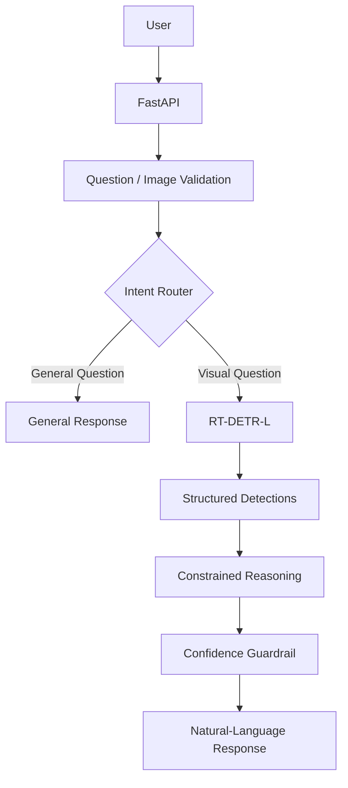
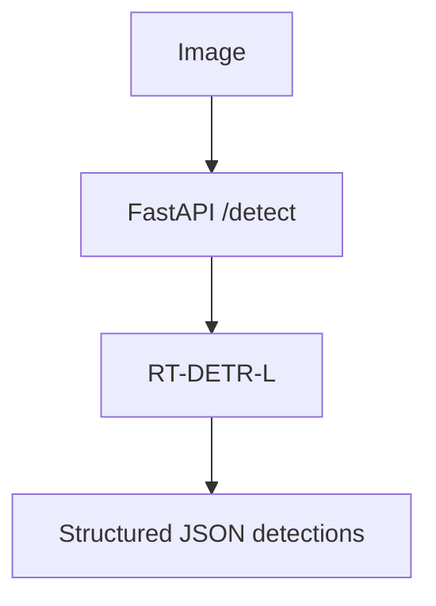
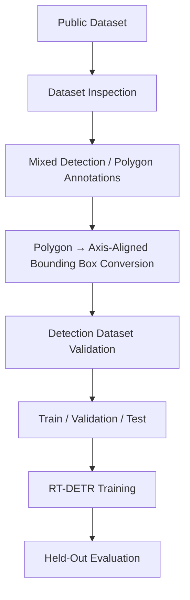
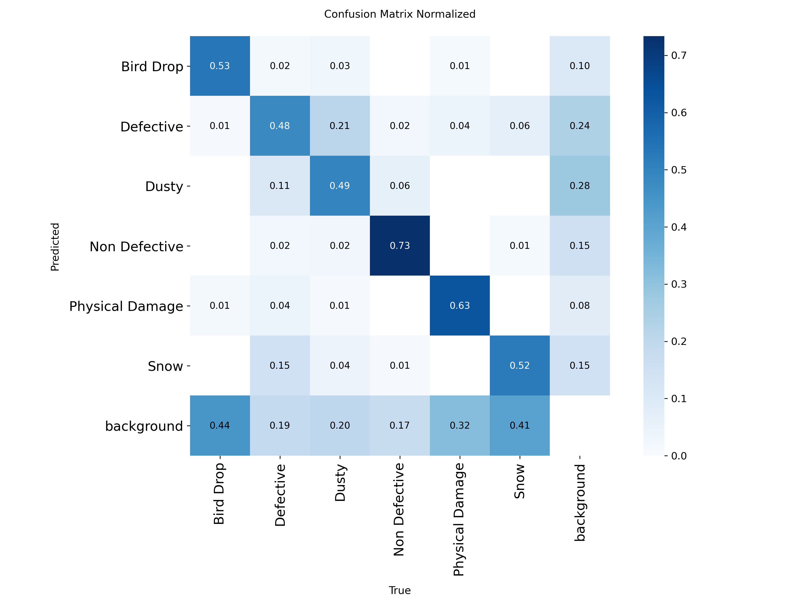
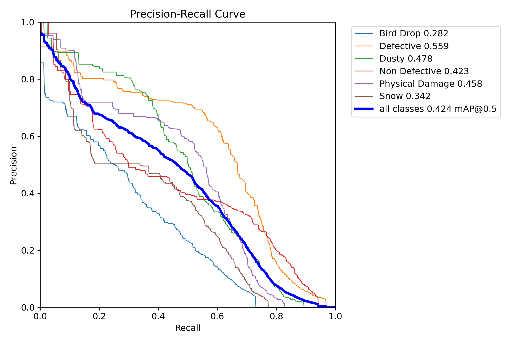
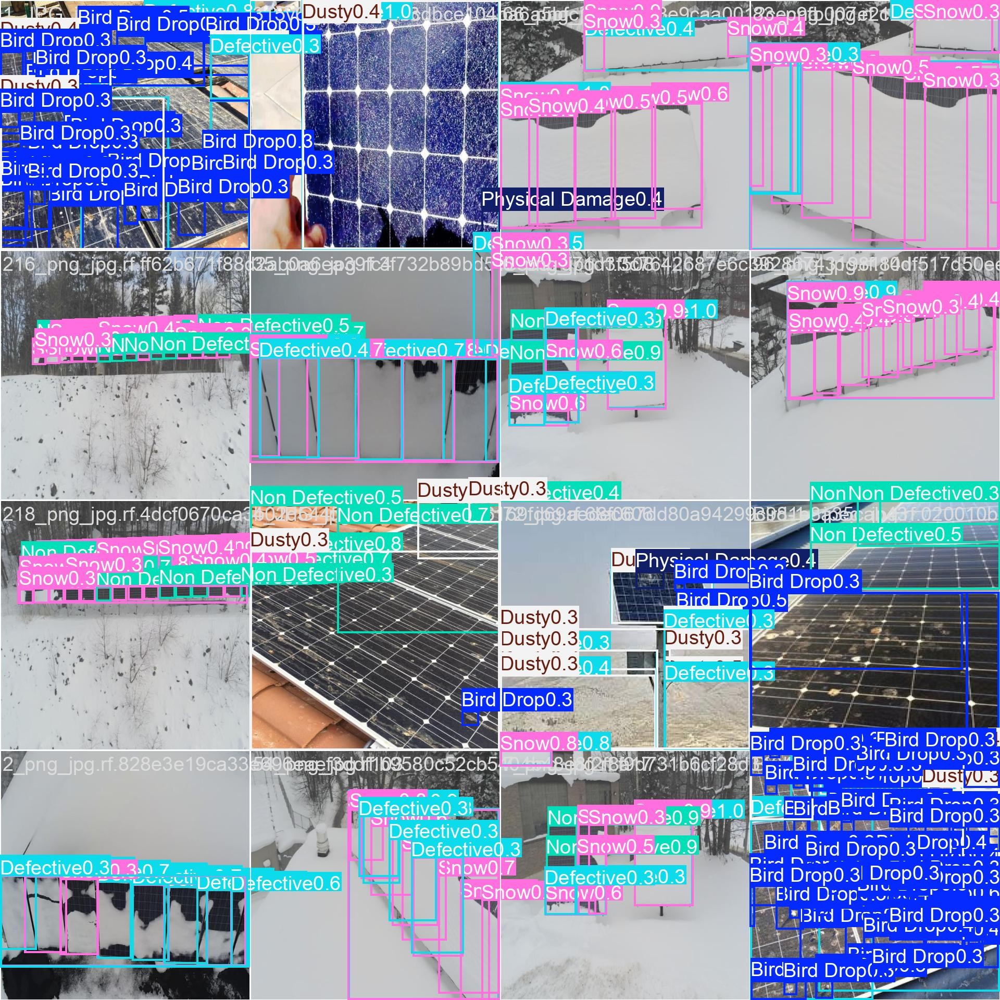
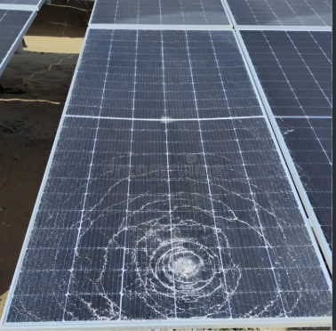
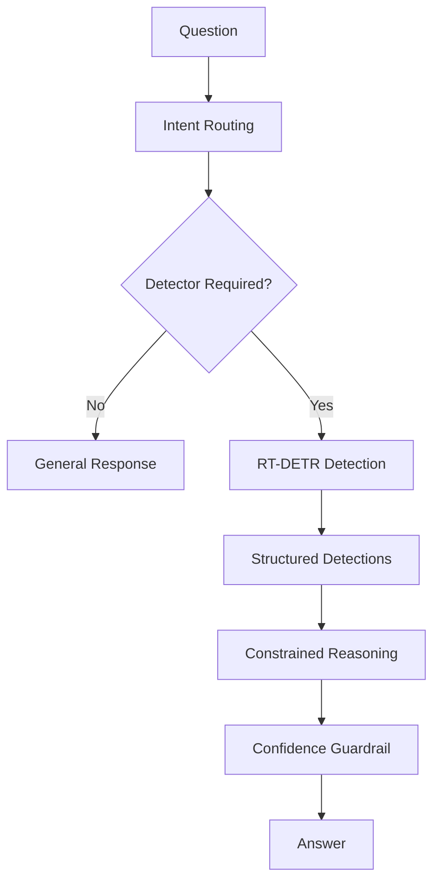

# SolarSight

### Constrained Solar Panel Fault Detection & Reasoning API

SolarSight is an RT-DETR-L based computer-vision system for detecting solar-panel faults and answering constrained natural-language questions over detector output through a deterministic reasoning layer.


| Area | Status |
|---|---|
| Object Detection | Verified |
| RT-DETR-L Weights | Included |
| FastAPI | Verified |
| Reasoning Layer | Verified |
| Guardrail | Verified |
| Unit Tests | 14 passed, 1 skipped |
| Integration Test | 1 passed |
| Dockerfile | Reviewed; runtime not locally executed |
| Public Deployment | Not yet deployed |

## Key Results

**Validation:**
- Precision: 0.529
- Recall: 0.560
- mAP50: 0.511
- mAP50-95: 0.348

**Held-out Test:**
- Precision: 0.442
- Recall: 0.514
- mAP50: 0.424
- mAP50-95: 0.271

**Training:**
- RT-DETR-L
- 20 epochs
- 640 image size
- batch 8
- Tesla T4
- ~3.066 hours

**Testing:**
- 14 passed
- 1 skipped
- 1 real-model integration test passed
- Latest integration runtime: 4.92 seconds CPU fallback

## System Architecture



**Direct Detection Route:**



## Data Pipeline



**Dataset Source:** [Solar Panel Fault Dataset New (v2)](https://universe.roboflow.com/6rianstorm/solar-panel-fault-dataset-new)

**Dataset:**
- 8,730 images
- v2
- 640×640
- six classes

**Final Split:**
- Train: 7,669 images
- Validation: 611 images
- Test: 450 images

**Classes:**
1. Bird Drop
2. Defective
3. Dusty
4. Non Defective
5. Physical Damage
6. Snow

*Note: Polygon annotations were converted to axis-aligned bounding boxes for the detection pipeline. We did not originally create or label this dataset. It is not stored in this repository.*

## Why Solar Panel Fault Detection?

Solar panel fault detection is a real-world visual inspection problem characterized by multiple visually similar fault categories. Object detection provides both localization and classification, allowing for precise defect isolation. The reasoning layer demonstrates constrained visual question answering directly over these localized faults. This domain features non-COCO-style categories, making it a robust testbed for domain-specific fine-tuning.

## Model

| Property | Value |
|---|---|
| Architecture | RT-DETR-L |
| Initialization | Pretrained rtdetr-l.pt |
| Framework | Ultralytics |
| Classes | 6 |
| Image Size | 640 |
| Epochs | 20 |
| Batch Size | 8 |
| Seed | 42 |
| Optimizer | AdamW |
| GPU | Tesla T4 |
| Training Time | ~3.066 hours |
| Checkpoint | model/best.pt |

*Note: The original training run used `optimizer=auto`, which resolved to AdamW.*

## Evaluation Results

| Metric | Validation | Held-out Test |
|---|---:|---:|
| Precision | 0.529 | 0.442 |
| Recall | 0.560 | 0.514 |
| mAP50 | 0.511 | 0.424 |
| mAP50-95 | 0.348 | 0.271 |

The held-out test performance is lower than validation performance, indicating a measurable generalization gap.

## Per-Class Performance

| Class | Precision | Recall | mAP50 | mAP50-95 |
|---|---:|---:|---:|---:|
| Bird Drop | 0.502 | 0.247 | 0.282 | 0.093 |
| Defective | 0.432 | 0.697 | 0.559 | 0.485 |
| Dusty | 0.342 | 0.587 | 0.478 | 0.341 |
| Non Defective | 0.374 | 0.592 | 0.423 | 0.302 |
| Physical Damage | 0.623 | 0.472 | 0.458 | 0.207 |
| Snow | 0.381 | 0.491 | 0.342 | 0.197 |

## Evaluation Artifacts

### Confusion Matrix


### Precision / Recall Curves


### Validation Prediction Examples



### Real-World Qualitative Check

*Real-world qualitative input*

## Failure Analysis & Limitations

### 1. Bird Drop — Low Recall
Test recall: 24.7%.
Likely contributing factor: small-object/background confusion.
Future mitigation: higher-resolution training/inference or tiled detection such as SAHI.

### 2. Defective vs Physical Damage
Real-world qualitative inference showed a strong Physical Damage prediction alongside overlapping Defective detections.
Interpretation: semantic ambiguity between visually related categories.
Future mitigation: more class-specific hard negatives/examples and taxonomy-aware post-processing.

### 3. Dusty — Lower Precision
Test precision: 34.2%.
Interpretation: visually ambiguous regions can produce false Dusty predictions.
Future mitigation: lighting/glare variation and hard-negative sampling.

### 4. Snow — Localization Difficulty
Test: mAP50 = 34.2%, mAP50-95 = 19.7%.
Likely contributing factor: axis-aligned boxes converted from polygon annotations can reduce localization precision.
Future mitigation: better box annotations or segmentation-aware labeling.

### 5. Non Defective — Semantic Ambiguity
Test precision: 37.4%.
Interpretation: healthy regions can be visually difficult to separate from visually similar fault/background regions.
Future mitigation: stronger hard-negative sampling and clearer class definition.

## Constrained Reasoning Layer



The reasoning layer routes questions based on deterministic Python logic. It strictly evaluates structured detector outputs and does not invent visual facts. If low-confidence evidence is provided, it triggers an insufficient-information guardrail. 

*Note: No LangChain, LangGraph, CrewAI, AutoGen, or other LLM/agent orchestration framework is used.*

## API

**Startup:**
```bash
uvicorn app.main:app --host 0.0.0.0 --port 8000
```

**Health Check:**
```bash
curl -X GET http://localhost:8000/health
```

**Detection Endpoint:**
```bash
curl -X POST -F "file=@test/sample_images/real_world_solar_test.png" http://localhost:8000/detect
```

**Visual Reasoning Endpoint:**
```bash
curl -X POST \
  -F "file=@test/sample_images/real_world_solar_test.png" \
  -F 'question="How many Physical Damage detections are present?"' \
  http://localhost:8000/reason
```

**General/Domain Question (No Image Required):**
```bash
curl -X POST \
  -F 'question="What is a solar panel?"' \
  http://localhost:8000/reason
```

## Testing & Reproducibility
The API is rigorously tested using `pytest`. The test suite includes mocked logic tests and an end-to-end integration test running on the actual trained weights.

```bash
# Run unit tests (Mocked)
PYTHONPATH=. pytest -v

# Run real-model integration test
PYTHONPATH=. pytest -m integration -v
```

## Deployment
The repository includes a `Dockerfile` and was statically reviewed for deployment readiness; local Docker runtime execution was not performed because Docker was unavailable on the development host.
