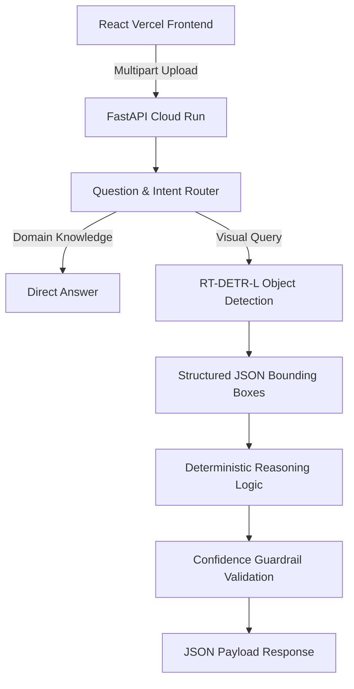

<div align="center">
  

  # SolarSight AI
  
  **See Every Fault. Understand Every Panel.**

  [](https://solar-sight-mu.vercel.app)
  [](https://solarsight-api-243267443769.asia-south1.run.app/docs)
  [](https://www.python.org/)
  [](https://pytorch.org/)

  SolarSight is an advanced computer-vision system built to autonomously detect solar-panel faults and provide deterministic, constrained natural-language reasoning over visual evidence.
</div>

---

## ⚡ Live Production Environments

SolarSight is fully deployed and operational.

- **Frontend Application (Vercel):** [https://solar-sight-mu.vercel.app](https://solar-sight-mu.vercel.app)
- **FastAPI ML Backend (Google Cloud Run):** [https://solarsight-api-243267443769.asia-south1.run.app](https://solarsight-api-243267443769.asia-south1.run.app)
- **Interactive API Documentation:** [Swagger UI](https://solarsight-api-243267443769.asia-south1.run.app/docs)

---

## 🧠 System Architecture

SolarSight separates concerns into a blazing-fast React frontend, a scalable FastAPI backend, an RT-DETR-L vision model, and a deterministic Python reasoning layer.

### End-to-End Workflow


### The Reasoning Pipeline
Unlike hallucination-prone LLM chains, SolarSight uses a strict deterministic routing and evaluation engine. It interprets structured bounding box coordinates, applies spatial and confidence thresholds, and triggers "Insufficient Evidence" safety guardrails if the user asks questions beyond the detector's capability. 

*Note: No LangChain, LangGraph, CrewAI, AutoGen, or other LLM/agent orchestration framework is used.*

---

## 🔬 Model & Dataset

Solar panel fault detection presents a difficult, highly ambiguous visual inspection challenge characterized by overlapping defect signatures (e.g., *Defective* vs *Physical Damage*).

### Dataset & Preprocessing
- **Source:** [Solar Panel Fault Dataset New (v2) on Roboflow](https://universe.roboflow.com/6rianstorm/solar-panel-fault-dataset-new)
- **Volume:** 8,730 images (Train: 7,669 | Val: 611 | Test: 450)
- **Preprocessing:** Original polygon annotations were programmatically converted to axis-aligned bounding boxes to train the object detection model.
- **Classes (6):** Bird Drop, Defective, Dusty, Non Defective, Physical Damage, Snow.

### RT-DETR-L Training Configuration
| Hyperparameter | Value | Hyperparameter | Value |
|---|---|---|---|
| **Architecture** | RT-DETR-L (Ultralytics) | **Input Size** | 640x640 |
| **Epochs** | 20 | **Batch Size** | 8 |
| **Optimizer** | AdamW (lr 0.001) | **GPU** | Tesla T4 (~3h train time) |
| **Initialization** | Pretrained `rtdetr-l.pt` | **Seed** | 42 |

---

## 📊 Evaluation Results

Performance was evaluated strictly on the **Held-Out Test Set** (450 unseen images) to measure true generalization.

| Metric | Validation (611 imgs) | Held-out Test (450 imgs) |
|---|---:|---:|
| **Precision** | 52.9% | 44.23% |
| **Recall** | 56.0% | 51.44% |
| **mAP@50** | 51.1% | 42.37% |
| **mAP@50-95** | 34.8% | 27.07% |

<details>
<summary><strong>View Per-Class Breakdown</strong></summary>

| Class | Precision | Recall | mAP50 | mAP50-95 |
|---|---:|---:|---:|---:|
| **Bird Drop** | 0.502 | 0.247 | 0.282 | 0.093 |
| **Defective** | 0.432 | 0.697 | 0.559 | 0.485 |
| **Dusty** | 0.342 | 0.587 | 0.478 | 0.341 |
| **Non Defective** | 0.374 | 0.592 | 0.423 | 0.302 |
| **Physical Damage** | 0.623 | 0.472 | 0.458 | 0.207 |
| **Snow** | 0.381 | 0.491 | 0.342 | 0.197 |

</details>

---

## ⚠️ Failure Analysis & Limitations

To ensure absolute transparency, we actively document known failure modes and generalization gaps:

1. **Bird Drop — Low Recall (24.7%)**  
   *Factor:* Extreme small-object/background confusion.  
   *Mitigation:* Tiled inference (SAHI) or higher-resolution training.
2. **Defective vs Physical Damage Ambiguity**  
   *Factor:* Semantic overlap between categories.  
   *Mitigation:* Taxonomy-aware post-processing and ontology refinement.
3. **Dusty — Lower Precision (34.2%)**  
   *Factor:* Glare and lighting variations masquerading as dust.  
   *Mitigation:* Aggressive hard-negative sampling.
4. **Snow — Localization Difficulty (mAP@50-95: 19.7%)**  
   *Factor:* Converting amorphous polygon masks into strict bounding boxes destroys edge precision.  
   *Mitigation:* Migrate from Object Detection to Instance Segmentation for amorphous classes.
5. **Non Defective — Semantic Ambiguity**  
   *Factor:* "Healthy" regions visually overlap with background structures.

---

## 📂 Project Structure

```text
SolarSight/
├── app/                  # FastAPI backend
│   ├── main.py           # Core API definitions
│   ├── detector.py       # RT-DETR model loading and inference
│   └── reasoning.py      # Deterministic intent routing & reasoning
├── frontend/             # React/Vite/Tailwind frontend
│   ├── src/
│   │   ├── components/   # UI components (Header, Viewer, Metrics, etc.)
│   │   └── App.tsx       # Main application layout
│   └── public/assets/    # Images & static assets
├── tests/                # Pytest suites
│   ├── test_main.py      # API endpoint unit tests
│   └── test_reasoning.py # Reasoning logic unit tests
├── model/                # ML Checkpoints
│   └── best.pt           # Trained RT-DETR-L weights
├── requirements.txt      # Python dependencies
└── Dockerfile            # Production container configuration
```

---

## 💻 Developer Setup & Reproducibility

### Backend Setup (FastAPI + PyTorch)
```bash
# 1. Clone & create environment
git clone https://github.com/santhoshr-15/SolarSight.git
cd SolarSight
python -m venv venv
source venv/bin/activate  # or `venv\Scripts\activate` on Windows

# 2. Install Dependencies
pip install -r requirements.txt

# 3. Start Development Server
uvicorn app.main:app --host 0.0.0.0 --port 8000 --reload
```

### Frontend Setup (React + Vite + Tailwind)
```bash
cd frontend
npm install
npm run dev
```

### Running the Test Suite
The API is rigorously tested. The test suite includes mocked logic tests and end-to-end integration tests running inference on the trained weights.

```bash
# Run isolated unit tests
PYTHONPATH=. pytest -v

# Run heavy real-model integration tests
PYTHONPATH=. pytest -m integration -v
```

---
<div align="center">
  <i>Engineered for precision. Built for scale.</i>
</div>
