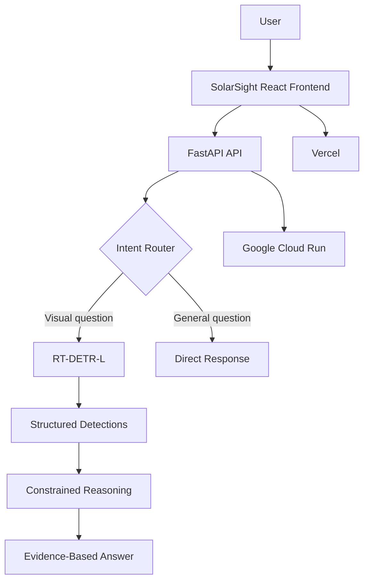

# ☀️ SolarSight

AI-Powered Solar Panel Fault Detection & Constrained Visual Reasoning

[](https://www.python.org/)
[](https://fastapi.tiangolo.com/)
[](https://reactjs.org/)
[](https://www.typescriptlang.org/)
[](https://vitejs.dev/)
[](https://pytorch.org/)
[](https://ultralytics.com/)
[](https://cloud.google.com/run)
[](https://vercel.com/)
[](https://docs.pytest.org/)

------------------------------------------------------------

## 🚀 Live Demo

**Frontend (Vercel):**  
[https://solar-sight-mu.vercel.app](https://solar-sight-mu.vercel.app)

**Backend (Cloud Run):**  
[https://solarsight-api-243267443769.asia-south1.run.app](https://solarsight-api-243267443769.asia-south1.run.app)

**GitHub:**  
[https://github.com/santhoshr-15/SolarSight](https://github.com/santhoshr-15/SolarSight)

## 📚 API Documentation

**Interactive Swagger UI:**  
[https://solarsight-api-243267443769.asia-south1.run.app/docs](https://solarsight-api-243267443769.asia-south1.run.app/docs)

**Health Check Endpoint:**  
[https://solarsight-api-243267443769.asia-south1.run.app/health](https://solarsight-api-243267443769.asia-south1.run.app/health)

## 🎯 Problem

Solar panel inspection can involve large numbers of panels and visually identifying faults can be difficult and time-consuming. 

SolarSight uses computer vision to identify:
- Bird Drop
- Defective
- Dusty
- Non Defective
- Physical Damage
- Snow

Then provides evidence-based natural-language reasoning over the detector output.

## 💡 Solution

SolarSight provides an end-to-end web application that processes uploaded solar panel images, performs high-speed object detection using RT-DETR-L, and utilizes a deterministic reasoning layer to interpret the visual results. It does not guess when visual evidence is insufficient.

## ✨ Key Features

- **Real-Time Detection:** Rapid processing of solar panel imagery.
- **6 Fault Classes:** Specialized detection for common solar panel anomalies.
- **Constrained Visual Reasoning:** Deterministic analysis of detected features to answer specific visual questions.
- **Confidence Guardrail:** The system rejects questions that lack sufficient visual evidence, ensuring reliable insights without hallucination.
- **Modern Architecture:** A React/Vite frontend communicating with a scalable FastAPI backend deployed on Google Cloud Run.

## 🧠 System Architecture



## 🔬 Computer Vision Pipeline

1. Image
2. Preprocessing
3. RT-DETR-L
4. Bounding Boxes
5. Class Labels
6. Confidence Scores
7. Structured Detection Output
8. Reasoning Layer

## 🗂 Dataset

- **Source:** Roboflow Universe
- **Dataset:** Solar Panel Fault Dataset New
- **Creator/source:** 6rianstorm
- **Version:** v2
- **Total images:** 8,730
  - Train: 7,669
  - Validation: 611
  - Test: 450
- **Object Counts:**
  - Train: 41,014 objects
  - Validation: 3,453 objects
  - Test: 2,796 objects

## 🛠 Dataset Preprocessing

The original dataset contained mixed detection and segmentation annotations. Local preprocessing converted polygon annotations into axis-aligned bounding boxes to create a consistent detection-ready dataset. 

*Note: The original dataset and annotations were sourced from Roboflow Universe and were not created by us.*

## 🤖 Model & Training

- **Model:** RT-DETR-L
- **Pretrained checkpoint:** `rtdetr-l.pt`
- **Transferred weights:** 926 / 941
- **Framework:** Ultralytics, PyTorch
- **GPU:** Tesla T4
- **Training time:** ~3.066 hours

**Exact Configuration:**
- Epochs: 20
- Batch size: 8
- Image size: 640
- Optimizer: AdamW
- Learning rate: 0.001
- Momentum: 0.9
- Seed: 42
- AMP: Enabled
- Workers: 2

## 📊 Evaluation Results

**VALIDATION Metrics:**
- Precision: 52.9%
- Recall: 56.0%
- mAP@50: 51.1%
- mAP@50-95: 34.8%

**TEST Metrics:**
- Precision: 44.23%
- Recall: 51.44%
- mAP@50: 42.37%
- mAP@50-95: 27.07%

## 📈 Class-wise Performance

Exact values from the test set:

| Class | Precision | Recall | mAP@50 | mAP@50-95 |
|---|---:|---:|---:|---:|
| Bird Drop | 50.2% | 24.7% | 28.2% | 9.26% |
| Defective | 43.2% | 69.7% | 55.9% | 48.5% |
| Dusty | 34.2% | 58.7% | 47.8% | 34.1% |
| Non Defective | 37.4% | 59.2% | 42.3% | 30.2% |
| Physical Damage | 62.3% | 47.2% | 45.8% | 20.7% |
| Snow | 38.1% | 49.1% | 34.2% | 19.7% |

## ⚠️ Failure Cases & Limitations

Engineering-level failure analysis reveals specific limitations:

1. **Bird Drop recall weakness:** Bird Drop test recall is 24.7%, showing that many such instances can be missed.
2. **Overlapping / ambiguous detections:** Visually similar fault patterns can result in multiple overlapping predictions.
3. **Localization limitations:** The gap between mAP@50 and mAP@50-95 highlights precision challenges when fitting bounding boxes tightly to irregular anomalies.
4. **Confidence threshold sensitivity:** Changing the confidence threshold can heavily influence the trade-off, removing weaker detections but potentially dropping true positives.
5. **Real-world visual ambiguity:** Lighting, image quality, viewpoint and visually similar surface patterns can make classification difficult.

### Difficulties Encountered
1. **Mixed YOLO detection + segmentation annotations:** The source dataset contained both formats, requiring preprocessing.
2. **Dataset normalization:** Polygon annotations had to be converted into detection-ready bounding boxes.
3. **Model training time:** The RT-DETR-L training run required approximately 3.066 hours on a Tesla T4.
4. **Cloud deployment memory:** The first Cloud Run configuration using 1 GiB memory was insufficient during model inference and exceeded the memory limit. The deployment was re-configured with 2 GiB memory, after which inference worked correctly.
5. **Production frontend/backend integration:** Production CORS and deployment configuration had to be carefully verified between Vercel and Cloud Run.

## 🧩 Constrained Reasoning

The reasoning implementation follows a strict structure:
1. Natural-language question
2. Intent routing
3. Determine whether detection is required
4. Run detector if needed
5. Read structured detections
6. Apply constrained reasoning
7. Confidence guardrail
8. Natural-language answer

This reasoning layer is lightweight Python logic. It does not use LLMs, agents, or frameworks like LangChain/CrewAI. If evidence is insufficient, it uses the guardrail response.

## 🔌 API Reference

### GET /health
Returns the current API health status.

### POST /detect
Accepts an image file upload (multipart/form-data) and returns structured detections (bounding boxes, classes, and confidences).

### POST /reason
Accepts a JSON body with `question` (string) and `image_url` (or uploaded file depending on implementation), routing it through the deterministic reasoning layer.

Refer to the live Swagger documentation for full schemas:  
[https://solarsight-api-243267443769.asia-south1.run.app/docs](https://solarsight-api-243267443769.asia-south1.run.app/docs)

## 🧪 Testing & Validation

The test suite covers API, reasoning, and integration behavior.
- **15 passed**
- **0 failed**
- **1 skipped**

## ☁️ Deployment Architecture

- **Frontend:** Vercel
- **Backend:** Google Cloud Run
- **Region:** asia-south1
- **Service:** solarsight-api
- **Runtime:** FastAPI container
- **Model:** RT-DETR-L
- **Memory:** 2 GiB
- **CPU:** 1
- **Concurrency:** 1
- **Min instances:** 0
- **Max instances:** 1
- **Startup CPU boost:** Enabled
- **Billing:** Request-based billing

## 🔁 Reproducibility

- **Python:** 3.13.15
- **PyTorch:** 2.11.0+cu128
- **Ultralytics:** 8.4.150
- **GPU:** Tesla T4
- **Training Params:** 20 epochs, batch 8, 640 image size, AdamW, learning rate 0.001, seed 42, AMP enabled.

*Please refer to `training/` and `SolarSight_Training_Evaluation.ipynb` for reproduction.*

## 📁 Project Structure

```text
SolarSight/
├── app/                  # FastAPI backend API and model inference
├── dataset/              # Dataset preprocessing and scripts
├── docs/                 # Documentation and project memos
├── evaluation/           # Evaluation scripts and performance metrics
├── frontend/             # React / Vite frontend application
├── model/                # Checkpoint files (best.pt)
├── test/                 # Additional tests and validation
├── tests/                # Pytest suites for API and logic
├── training/             # Scripts for training RT-DETR-L
├── Dockerfile            # Container configuration for Cloud Run
├── README.md             # Project documentation
├── requirements.txt      # Backend Python dependencies
├── pytest.ini            # Pytest configuration
└── SolarSight_Training_Evaluation.ipynb # Training & evaluation notebook
```

## 🐳 Docker

You can build and run the backend locally using Docker:

```bash
docker build -t solarsight-backend .
docker run -p 8080:8080 solarsight-backend
```

## 💻 Local Development

**Backend:**
```bash
pip install -r requirements.txt
uvicorn app.main:app --host 0.0.0.0 --port 8000 --reload
```

**Frontend:**
```bash
cd frontend
npm install
npm run dev
```

## 🔮 Future Improvements
- Move from object detection to instance segmentation to better handle amorphous categories like Snow.
- Address precision drops with class-specific post-processing thresholds.
- Expand the dataset to reduce visual ambiguity.

## 👨‍💻 Project

Built with precision for robust solar-panel visual inspection.
